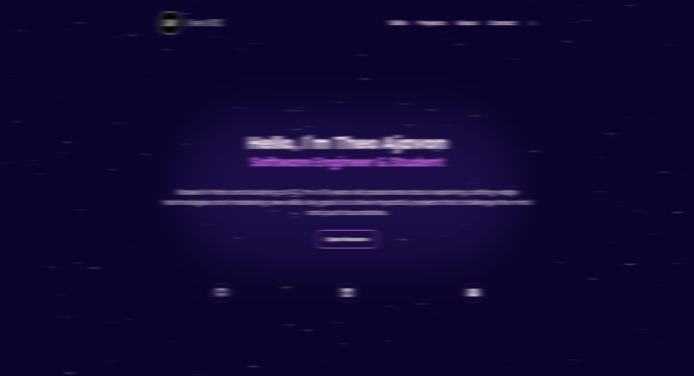
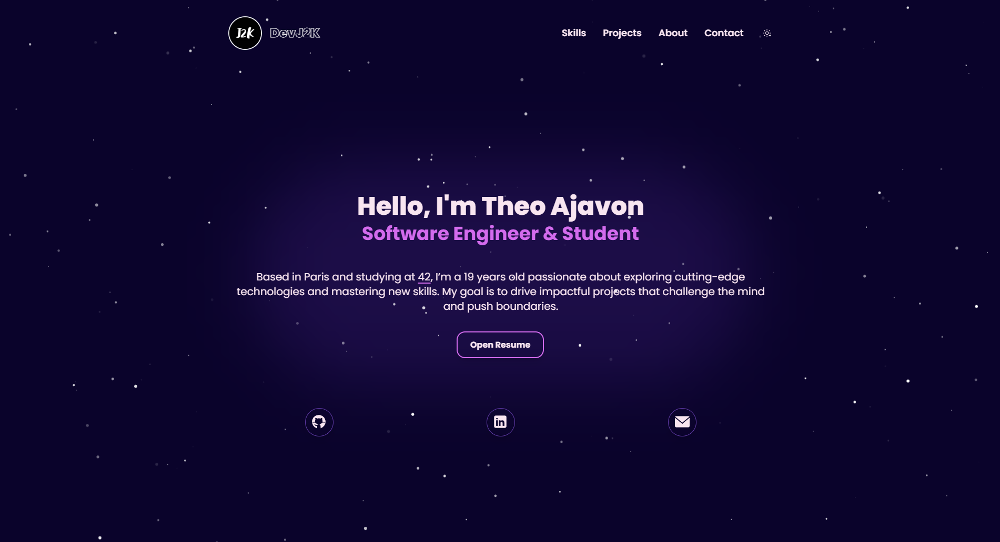

<!--
## Todo
- [x] Responsive font size
- [x] Add dots on timeline AboutView + change line width
- [x] Make projects card more attractive
- [x] Fix responsive on iPhone SE and check others
- [x] Margin between each tab
- [x] Add sphere or stars on background to create an atmosphere + gradient effect
- [x] Add shiny effect on the background + simulate lights ( + try tiles background )
- [x] Add real text + redirection (href) + hide breakpoint indicator
- [x] Find color theme + background color
- [x] Navigation bar in < breakpoint Md
- [x] Light and Dark Mode
- [x] Hover effects on each button
- [x] Adding Firebase
- [x] Suspense effect on project card
- [x] Contact page working + modal to indicate success or failure
- [x] Animation on appear
- [x] Filter project by categories in ProjectsView
- [x] Protect firebase request + Rules in Firebase
- [x] Adding custom console.log
- [x] Add videos from storage in AboutView
- [x] Optimize App + CSS
- [x] Adjust dark mode color (Bg, border,...)
- [x] Navbar in AboutView at breakpoint <= Md
- [x] Same navbar for all tabs ? No
- [x] AboutTab > AboutCard color are different
- [x] Animation left to right View More Btn
- [x] Fetch img for project from Storage | Use a canva or default image instead
- [x] Turn on all fetch from Firebase
- [x] about-div-tab pop-up animation
- [x] Background for PresentationTab
- [x] Highlight certain AboutCard + Possibility to add link in AboutCard
- [x] Little paragraph to explain Tab in ProjectsView
- [x] Find solution about 3D videos because Storage is too expensive. Use iFrame instead.
- [x] Put all local-data.json & about-data.json on Firestore
- [x] Project link for aboutCard
- [x] Add date field on each data to order by Date
- [x] Add Feedbacks / Experiences tab
- [x] Change index.html Title name + change logo
- [x] Fix z-index for max-md:navbar & footer
- [x] Fix stars background for mobileVersion
- [x] Add period to ProjectCard
- [x] Add CV to local route
- [x] Use localData instead Firestore
- [x] Add contact@devj2k.com
-->
<!-- https://developer.mozilla.org/en-US/docs/Web/API/Canvas_API/Tutorial/Drawing_text -->
<!-- - [ ] Search project animation -->

# My Portfolio

## 🌟 About the Project

This portfolio was **designed and conceptualized by me** using **Figma**. It was brought to life with a strong focus on detail and user experience, leveraging modern technologies like **Tailwind CSS** and **Vue.js** to ensure a sleek and responsive interface.

## 🌐 Check It Out

> **[devj2k.com](https://devj2k.com)**

Visit my website to explore my projects, see my skills, and learn more about me.

## 🚀 Built With

- **Figma** for design and prototyping.
- **Tailwind CSS** for fast and custom styling.
- **Vue.js** for a dynamic and responsive user interface.

## 📸 Preview

Here's a sneak peek at my portfolio:

## 🔗 Useful Links

- **Website**: [devj2k.com](https://devj2k.com)
- **LinkedIn**: [My LinkedIn Profile](https://www.linkedin.com/in/devj2k)
- **GitHub**: [My GitHub](https://github.com/DevJ2K)

<!--
## 📝 License

This project is licensed under the MIT License. See the [LICENSE](LICENSE) file for more details.
-->
